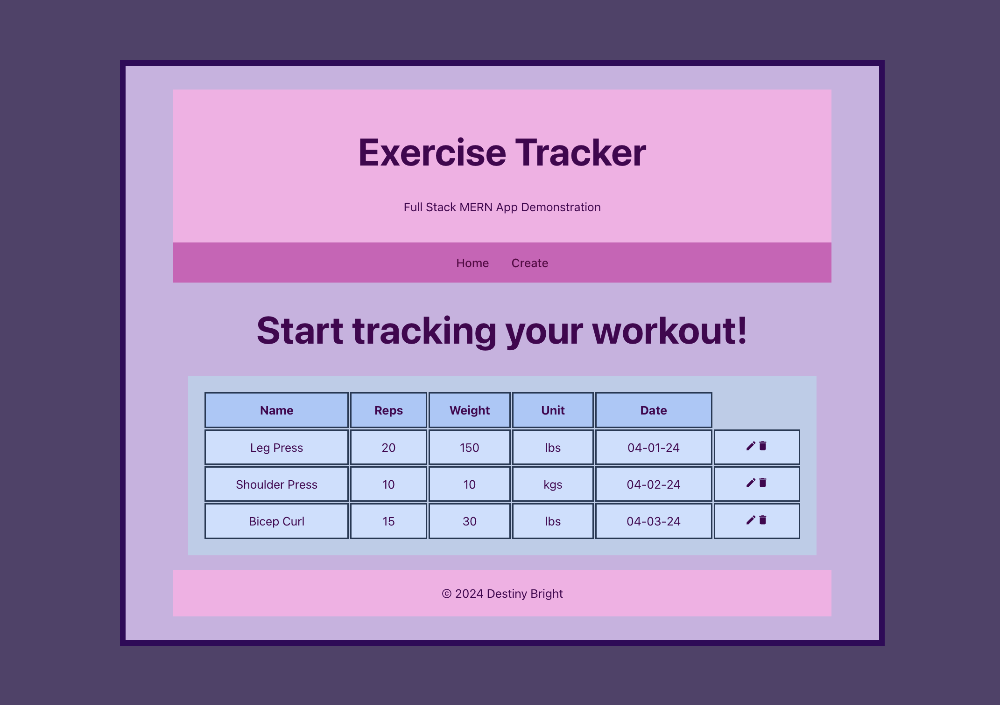

# Exercise Tracking Application

A simple web application to track exercises using [MongoDB], [Express], [React], and [Node.js] to do CRUD operations.

- The back end REST API is located here [exercise-mern/exercises-rest](exercise-mern/exercises-rest)
- The front end user interface is located here [exercise-mern/exercises-react](exercise-mern/exercises-react)

[MongoDB]: https://www.mongodb.com/
[Express]: https://expressjs.com/
[React]: https://reactjs.org/
[Node.js]: https://nodejs.org/en/
